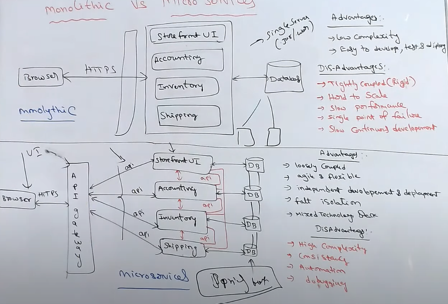

# Microservices vs Monolithic Architecture

# Rest services and crud operations
- para crear un servicio rest necestiamos con controlador con las siguientes anotacones:
# @RestController
se utiliza para marcar la clase como controlador de una app web
se encargan de manejar las solicitudes http y enviar formatos de respuesta json xml entre otros.
# @GetMapping("/nombre de la ruta")
Se usa para mapear metodos a solicitudes http get 
# @PostMapping("/")
Se utiliza para mapear metodos a solicitudes post (creacion)
# @PutMapping("/")
mapea a solicitudes put (Autualización)
# @DeleteMapping("/")
mapea a solicitudes delete (borrar)
# PathVariable 
@GetMapping("/hello/{name}")
public String sayHello(@PathVariable String name) {
return "Hello, " + name + "!";}
- se utiliza para vincular una variable de método a una variable de una parte de la URL
en una solicitud HTTP.

# @RequestBody 
se utiliza en métodos de controlador que manejan solicitudes HTTP POST, PUT o PATCH,
donde el cuerpo de la solicitud 
contiene los datos que se desean enviar al servidor.

#  @PathVariable
Spring toma el valor de la variable presente en la URL y lo asigna al 
parámetro correspondiente en el método del controlador.
- Se utilizan para acceder a valores dinámicos en la URL.
- Son útiles para construir URLs con variables que cambian 
(por ejemplo, identificadores de recursos).

# @RequestParam
- Se utiliza para obtener parámetros de consulta de una solicitud HTTP (por ejemplo, parámetros enviados en la URL con ?
clave=valor
- Se pueden utilizar para solicitudes GET y POST.

# @Entity
- Se usa para indicar que la clase es una tabla en la base de datos 
- Para que la clase sea entidad se necesita dos requisitos constructor sin argumentos y un identificador unico
que mapea la llave primaria 
- Atributos y anotaciones comunes @Colum(name="")-- @Table(name="") -- @id(id)

# Clase ResponseEntity <T>
- Se usa para representar una respuesta http mas personalizada 
- se utiliza en combinacion con los controladores spirng para devolver respuestas personalizadas
- Permite crear objetos con difernetes estados http algunos son:
- ok() objeto con estado http 200 
- ok(T body) T representa el tipo de contenido
- status(HttpStatus status): Crea un objeto ResponseEntity con el estado HTTP especificado y sin contenido adicional.
- status(HttpStatus status, T body): Crea un objeto ResponseEntity con el estado HTTP especificado y el contenido especificado en el cuerpo.
- notFound(): Crea un objeto ResponseEntity con un estado HTTP 404 Not Found y sin contenido adicional.
- badRequest(): Crea un objeto ResponseEntity con un estado HTTP 400 Bad Request y sin contenido adicional.
- created(URI location): Crea un objeto ResponseEntity con un estado HTTP 201 Created y una cabecera Location que apunta a la ubicación del nuevo recurso creado.
- headers(HttpHeaders headers): Crea un objeto ResponseEntity con los encabezados HTTP especificados y sin contenido adicional.

# Mockito and JUnit 5
- Es un framework que se usa para simular objetos (mocks) para hacer pruebas unitarias
- Los mocks permiten simular el comportamiento de componentes dependientes en pruevas unitarias.
@InjectMocks
Se usa para inyectar el serivio (capa logica) que se desa probar.
@Mock
se utiliza para crear un mock del repositorio la dependecia externa.

metodo when()
se utiliza para configurar el comportamiento de los mocks.
verify() 
se utiliza para asegurarse de que ciertos métodos se llamen según lo esperado en tus pruebas unitarias,
lo que te permite verificar la interacción entre objetos simulados y el código que estás probando.